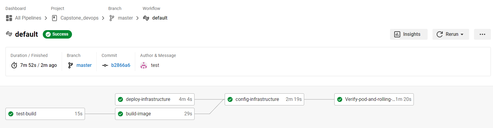
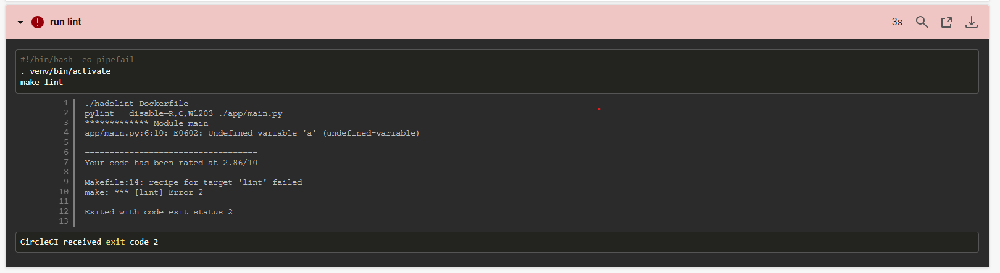
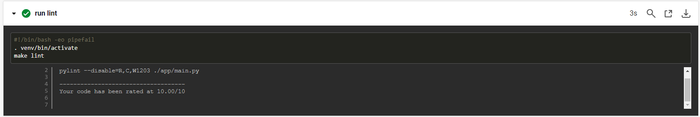
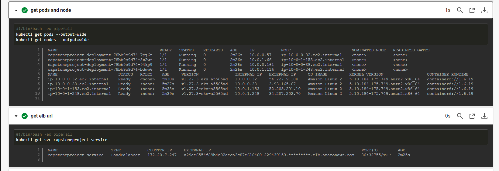
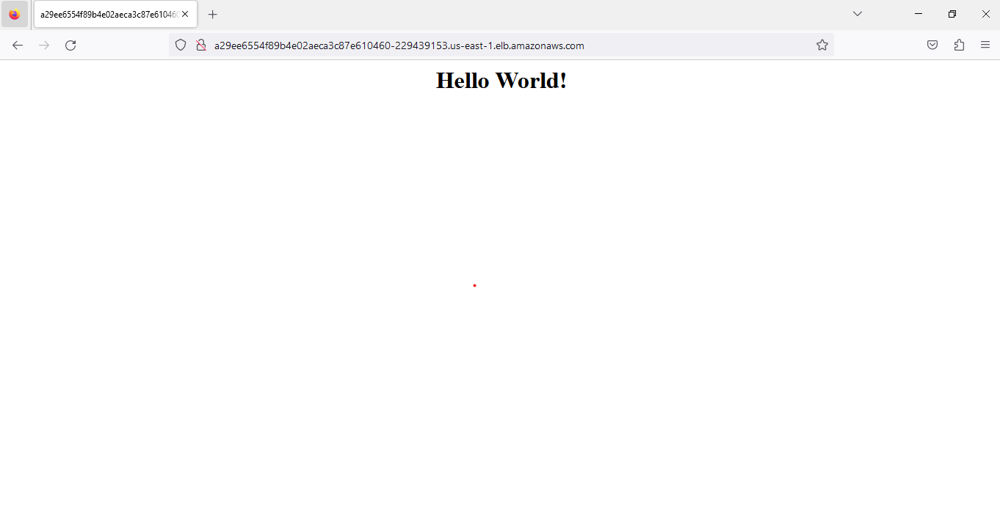

# Project Overview

In this my project on Capstone project and the Cloud DevOps Engineer Nanodegree at Udacity

# What I learn ?

In this project you will apply the skills and knowledge which were developed throughout the Cloud DevOps Nanodegree program. These include:

+ Working in AWS
+ Using Jenkins or Circle CI to implement Continuous Integration and Continuous Deployment
+ Building pipelines
+ Working with Ansible and CloudFormation to deploy clusters
+ Building Kubernetes clusters
+ Building Docker containers in pipelines

## Introduce my project
   My project using flask to render a simple webpage in the user's browser. I will use Circle CI to CI/CD and use aws service, kubernetes to management

## Url

+ Github:         https://github.com/hanguyen31099/Capstone_devops
+ Docker hub:     https://hub.docker.com/repository/docker/ducha31099/devops-capstone/general
+ Load balancers: http://a29ee6554f89b4e02aeca3c87e610460-229439153.us-east-1.elb.amazonaws.com

## Attachment screenshot

### CircleCi - CI/CD Pipelines

### Linting using Pylint and Hadolint

### Pod status and external IP

### Public LB DNS: http://a29ee6554f89b4e02aeca3c87e610460-229439153.us-east-1.elb.amazonaws.com

